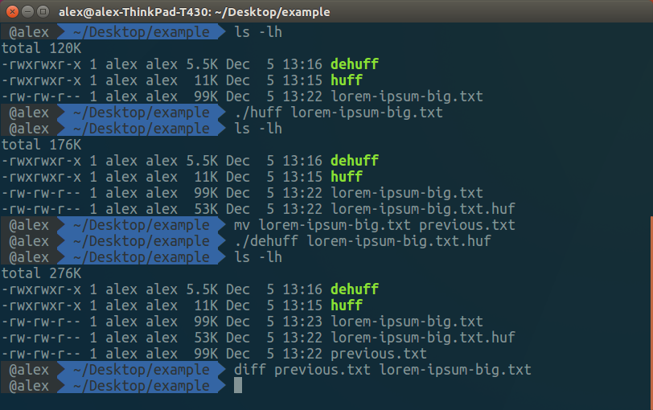

# Canonical Huffman Compression

**A toy implementation of file compression with Canonical Huffman Encoding.**



__Compiling and running the program:__

This program was written and tested on Ubuntu 16.04 with the mono compiler.
Assuming you have a similar setup, simply running `make` should work.
If you have a different setup/compiler the relevant files for compression are:

	Compressor.cs (Main method),
	SymbolNode.cs,
	InternalNode.cs,
	LeafNode.cs,
	HuffmanTree.cs,
	SymbolPriorityQueue.cs,
	CodeBook.cs

The files for decompression are:

	Decompressor.cs (Main method),
	BitBuffer.cs

Note that because of potential instability, no files are ever destroyed or overwritten during the compression/decompression process, so a failure on the part of the program shouldn't result in the loss/corruption of data. Having said that, the program shouldn't have any trouble compressing/decompressing Unicode encoded text, which is its intended use.

__Format for the outputted file:__

section format: [(byte count)contents]

if Huffman compression is used:

```[(1) 1, indicating Huffman compression][(4) number of input symbols (not necessarily the length of the file in bytes however)][(1) length of the codebook (and therefore number of unique symbols)][(var)code book][(var)encoded file]```

The codebook is stored as follows:

```(...[(1-2)Unicode Character][(1)length of the character's code]...)```

Note that because the length of a given character's code is expressed
by a single byte, the maximum length (and therefore maximum count
of unique symbols) is limited to 255.

if count compression is used:

```[(1) 0, indicating count compression][(1-2)symbol][(4)count]```